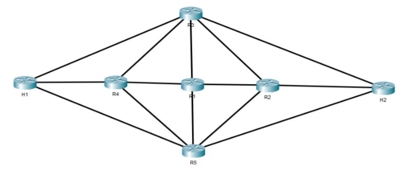
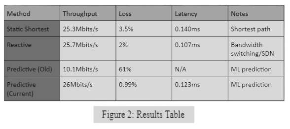

If your viewing this in Visual Studio Code, press Ctrl + Shift + V, to view file in the intended Markdown format. <br><br>

# Project 5: Delay-Predictive Routing for Emulated Non-Terrestial Networks
Contributors: Spencer Craig, Alexandre Picard, Cameron Wellman, Justin Le<br>

### I. Introduction 
Low Earth Orbit (LEO) satellites operate at altitudes of approximately 200 kilometers above Earth and travel at velocities approaching 27,400 kilometers per hour [1]. These satellites traverse in various directions at high speeds while functioning in extreme environmental conditions.<br><br>
These operational and coordination constraints impose limitations on uplink and downlink performance for commercial users on the ground. Despite the deployment of over 10,000 operational Starlink LEO satellites, median download speeds exhibit significant regional variation, ranging from approximately 187.3 Mbps in Latvia to 15.87 Mbps in South Sudan [2].<br><br>
As satellite constellations continue to expand, tens of thousands of both legacy and newly deployed LEO satellites must interoperate seamlessly to maintain reliable global coverage and network continuity. As such, optimization is paramount. <br><br><br>

### II. PROBLEM STATEMENT
Low Earth Orbit satellite constellations primarily rely on reactive or static shortest-path algorithms. These methods struggle to maintain high performance in rapidly changing environments where link availability and link delays change frequently. Current static and reactive routing models cannot anticipate link degradation, leading to excessive packet loss. This project addresses the lack of foresight in Non-Terrestrial Networks routing by implementing machine learning-based delay prediction to ensure smooth packet delivery in dynamic network environments.<br><br><br>

### III.  TOPOLOGY
To emulate a non-terrestrial networking or LEO environment, our research group used Linux Ubuntu with Mininet to create the topology. <br>
As displayed in Figure 1, the topology consist of: 
- Open vSwitch switches (s1–s5) forming a core mesh network. These switches represent LEO satellites. 
- 2 hosts (h1 at 10.0.0.1/24 connected to s3; h2 at 10.0.0.2/24 connected to s2). These hosts represent ground stations on Earth. 
- Fully meshed switch interconnections: 
    - S1↔{s2, s3,s4, s5}
    - S2↔{s3, s5}
    - s3↔s4, s4↔s5​<br><br>

<br><br><br>

### IV.  EMULATION ENVIRONMENT
In order to properly evaluate the delay predictive routing model, we had to make some early choices that aligned with our planned testing methods. Our first of these decisions was to select Mininet as our network emulation platform. We needed Mininet’s high-fidelity emulator, as it uses real Linux network namespaces. This allows us to simulate actual packet payloads to ensure the simulations of our environment are highly accurate, making evaluating and testing on traffic much more reliable. Mininet also has another feature we utilized for our simulation of the network, the OpenFlow protocol. OpenFlow allows the controller to push flow entries dynamically, which is how our AI delay predictor interacts with the topology. <br><br>
When creating the design of our topology, we had to ensure we properly emulated a localized segment of a LEO (Low Earth Orbit) network. We did not make a large, intensive topology, so we kept it on the more simplistic side. Its star mesh configuration ensures multiple different paths to reach all hosts inside the network, meaning we could better demonstrate the path selection and delay predictive components of our Ai code. We had on the ends 2 devices being h1 and h5 to emulate our on-earth network devices, switch 3 and switch 2 being the connection points of our hosts. The rest of the devices in the topology served to emulate low-orbit satellites. This architecture is an accurate reflection of ISLs (inter-satellite links) and also manages to provide our Ai code with a good base to enable meaningful routing decisions, which is something a more conventional tree or point-to-point topology would not be efficient in. <br><br>
Our last major choice was the RYU controller. Integration of RYU is aligned with multiple objectives we had for our emulation environment, as it has a native Python architecture that can use the Python-based machine learning libraries that we would utilize for our Ai code. We also utilized RYU for our simulation of network delay with its BandwidthController function to randomly throttle the capabilities of certain ports, thus causing the network state to change randomly and continuously throughout it being run. In summary, RYU both facilitated creating the variables of delay we would be testing if the AI code could route around, and facilitated the AI code's integration with our code.<br><br><br>

### V. MACHINE LEARNING
With over 10,000 LEO satellites orbiting the planet, it creates a highly complex and high-dimensional input space for machine learning-based path optimization. According to academics in the 2021 International Conference on Artificial Intelligence, Big Data and Algorithms (CAIBDA) held in Xi’an China, Deep Deterministic Policy Gradient (DDPG) is well-suited for problems involving high-dimensional state spaces with a low-dimensional and discrete action spaces. This characteristic makes DDPG particularly appropriate for this application, where vast input satellite data must be processed to produce a simple output - the optimal path with minimal latency [3]. <br><br>
For the scope of the research,  the Deep Deterministic Policy Gradient (DDPG) algorithm was selected. DDPG is an off‑policy reinforcement learning method that enhances its performance by learning from previously collected experiences. DDPG is also designed to adapt to parameters that fluctuate in its environment, similar to non-stationary links in space. This makes the machine-learning algorithm, DDPG, well suited for predictive decision making.<br><br>
In the project’s implementation, a Q-learning agent predicts the optimal routing paths under dynamic link conditions, integrated into a Linux Ryu SDN controller. This Q-learning agent operates on a negative-reward system, where it's penalized for loss/high delay. <br><br><br>


### VI. EXPERIMENTATION
Controllertopnew.py is first executed. This is the main python file that builds the simulated LEO topology and executes all other Python functions and files such as BandwdithController.py, LatencyCheck.py, and currentML.py. <br><br>
BandwidthController.py helps integrate the Ryu controller. This controller performs two functions: 
1) Randomly assigns bandwidth onto all links every time the topology is generated.
2) After latency is measured (in LatencyCheck.py), the Ryu controller acts as a bridge and feeds this data to the Machine Learning algorithm. <br>

After the topology and controller are set up, LatencyCheck.py runs on every LEO satellite to determine the delay to its closest neighbor. It sends a defined number of ICMP echo requests and computes the average round‑trip time. The resulting latency measurements are reported to the Ryu Controller, which then forwards them to the machine learning algorithm or another routing protocol. The reported latency is fed into DDPG and (STP Spanning Tree Protocol) to compare and accurately measure the effectiveness of AI. <br><br><br>

### VII. RESULTS AND ANALYSIS
In this section of the report we will evaluate the difference in performance across the three methods used for Delay-Predictive Routing for Emulated Non-Terrestrial Networks. The purpose will be to determine  whether a short-term delay prediction can actually improve routing performance in ever evolving topologies, using the LEO satellite constellation as our model. We will dive into three different routing strategies used: static shortest-path as our baseline, reactive where we use the Ryu SDN controller with bandwidth switching and lastly our current machine learning-driven predictive controller.<br><br>
Referring to figure 2 we can see that the Predictive (Current) approach offers the best performance in two of the three key sections. It consistently outperforms both static shortest path and Reactive approaches in terms of both throughput and packet loss. Specifically, the predictive(Current) method delivers approximately 2% higher average throughput rate while also reducing the average amount of packet loss by an 64% when compared to the older methods excluding the Predictive (Old). Furthermore, while the reactive method still provides the lowest latency of 0.107ms, the Predictive (Current) method still maintains a very competitive latency of approximately 0.123ms while still offering significantly more robust data delivery metrics.<br><br>
From a more broad perspective we can say that the observed results primarily improve quality of service (QoS) rather than raw performance increase. The key trade-off of the gains introduced by the predictive machine learning algorithm is that we now introduce extra control-plane complexity, meaning that the algorithm needs continuous access to training data to remain well attuned to the topology and its traffic patterns. In the context of LEO satellites this additional overhead may be especially hard to justify given its less noticeable improvement over our reactive method. By the same token, the massive contrast with the previous Predictive (Old) algorithm highlights that the benefits of the machine learning algorithm can still be difficult to achieve such as poor model design can dramatically affect performance.<br><br>
These results should be interpreted with several limitations in mind. Knowing that the experimentation was conducted in a non-terrestrial network with specific topology size and a specific amount of links these results may differ in the real world where there this topology would need to be scaled up significantly. It should also be considered that if the delay predictions are out of date the predictive controller can also lose all its benefits, potentially making routing even worse than it is.<br>
<br><br><br>


### VIII. CONCLUSION
Overall, short‑term delay prediction using the DDPG machine learning algorithm improves routing stability and packet delivery in highly dynamic topologies. Although it increases latency because of machine learning overhead, it compensates for this weakness by reducing loss of data by half. <br><br>
With these findings, machine learning algorithms should be implemented in LEO to improve network performance. <br><br><br>

### IX. RELATED WORK
<b>Dynamic Routing for Integrated Satellite-Terrestrial Networks: A Constrained Multi-Agent Reinforcement Learning Approach</b><br>
This paper focuses on how satellite-terrestrial networks have become more complex over time and how this complexity can be overcome through the use of reinforcement learning. This paper is not directly linked to our project in terms of using machine learning for optimizing the best path through a network. Instead the main connection is through the use of machine learning to simplify the mechanics of a complex system. The paper discusses the importance of dynamic routing algorithms have become, especially those now incorporating machine learning to aid in dynamically recalculating routes compared to the older static ones. We found the methodology for the cost metric of the machine learning model interesting because instead of putting costs on each link, it is set in relation to the total number of dropped files.<br><br>


<b>A deep reinforcement learning-based multi-optimality routing scheme for dynamic IoT networks</b><br>
This paper considers the application of deep reinforcement learning for routing dynamic IOT networks. While this paper is not about non terrestrial networks, we found it to still be relevant because of its use of machine learning to maintain routing consistency through complex, moving networks. It outlines the challenges of routing through changing topologies, similar to our variable bandwidth links, where links change states and quality often. This is often the case with IOT devices because of their less resilient and mobile nature. Another interesting point is the scalability concerns when using machine learning over a very large changing network. Which would be the case for a larger scaled up variant of our project. The authors reference using a distributed routing model rather than a centralized one for larger networks because it distributes the computational load more evenly so that updates can happen for the changing paths more frequently without needing to spend large amounts of time recalculating.<br><br>

<b>Predicting Internet end-to-end delay: an overview</b><br>
This paper is a great connection to the core of our project, the delay prediction. The paper describes how predicting the end to end delay is important to choose the best routing algorithm to use. It explains the importance of this because of how dynamically the internet shifts, and that delay prediction is becoming more and more important to allow for consistent traffic flows. We found that this paper does a good job at explaining the importance of delay prediction  as well as explaining different machine learning approaches, mainly model based and neural based and going over their benefits and drawbacks. The authors recommend using a hybrid approach, as it allows you to have the benefits of both while still balancing the drawbacks. This connects back to our project through our choice of model as well as the fundamental function of delay prediction in our bandwidth changing network design.<br><br>

<b>Reinforcement Learning with Deep Deterministic Policy Gradient</b><br>
This article discusses the basics of DDPG and some practical applications of the model in the real world. It also goes into great detail about the specifics of the algorithm itself and its evolution from Q Learning. Our project uses this exact algorithm for our delay prediction with the controller to determine the best route for the traffic to take. The article compares the differences between Q Learning, that it does not scale well, DQN, that it has some improvements in depth for its algorithm but still has issues when it comes to scalability, and lastly DDPG, the extended variant of DQN that is more effective for frequent changes because of non discreet weighting. This allows more outside of predefined paths, which is better for a complex routing environment with many potential pathing options. <br><br><br>


### X. REFERENCES

[1]G. Brown and W. Harris, “How Satellites Work,” howstuffworks. https://science.howstuffworks.com/satellite6.htm (accessed Mar. 29, 2026).<br>

[2]M. Dano, “2025 Global Satellite Broadband Performance Report | Ookla®,” Ookla - Providing network intelligence to enable modern connectivity, Feb. 04, 2026. https://www.ookla.com/articles/2025-global-satellite-broadband-performance-report<br>

[3] H. Tan, “Reinforcement Learning with Deep Deterministic Policy Gradient,” IEEE Xplore, May 01, 2021. https://ieeexplore.ieee.org/document/9545961<br><br><br>


# Other notes
- Code language: Python 
- By default, 
    - The machine learning algorithm executes 100 iterations. 
    - The source is H1. 
    - The destination is H2. 
- Requires Linux Ubuntu and Mininet.
<br><br><br>


# How to run the code
1) Install Ryu in Linux. 
2) Inside of vm, cd ```cd /home/mininet/ryu```
3) Then enter the below commands 
``` 
sudo apt install -y python3-pip 
git clone https://github.com/osrg/ryu.git 
sudo python3 ./setup.py install 
sudo pip3 install --upgrade ryu
```
4) In the first Linux terminal, enter the command: ```python3 controllertoponew.py```
5) In a secondary terminal, enter the command: ```ryu-manager bandwidth_controller.py```
6) Program will then start running
7) In an internet browser within Linux, type the following url: https://localhost:5000 
8) Note: When finished please enter  ```sudo mn -c```
<br><br><br>

# Dictionary 

### Learning rate 
`self.learning_rate=0.1`

0 > x > 1<br>
Learning rate is the degree to which the AI can deviate/adjust/correct its own parameters. <br>
- High score = overcorrection <br>
- Low score = little variance in action <br>
Best to start high, then go lower. <br>
Source: [Reddit - Learning Rate](https://www.reddit.com/r/MLQuestions/comments/h7z4o8/what_is_the_best_learning_rate_why/)<br><br>


### Discount 
`self.discount = 0.9`

0 > x > 1 <br>
The tendency to choose long-term rewards. <br>
- Lower score will make agent learn actions that produce an immediate reward.<br>
- Higher score will make agent evaluate each of its action based on the sum total of all its future rewards. <br>

Source: [Stack Exchange - Discount factor in reinforcement learning](https://stats.stackexchange.com/questions/221402/understanding-the-role-of-the-discount-factor-in-reinforcement-learning) <br>
Source: [Medium.com - Discount factor](https://medium.com/@bhavya_kaushik_/the-discount-factor-c9fb4984085e) <br><br>

### Epsilon 
`self.epsilon=0.1`<br>
`random.random() < self.epsilon `

0 > x > 1 <br>
The chance that the agent will explore a new action and its associated reward. <br>
In this case: <br>
- the exploration is 10%. <br>
- the chance to pick an already-known action is 90%. <br>

Source: [GeeksForGeeks.com - Epilson](https://www.geeksforgeeks.org/machine-learning/epsilon-greedy-algorithm-in-reinforcement-learning/) <br>
Look under "Exploration vs Exploitation" section. 
